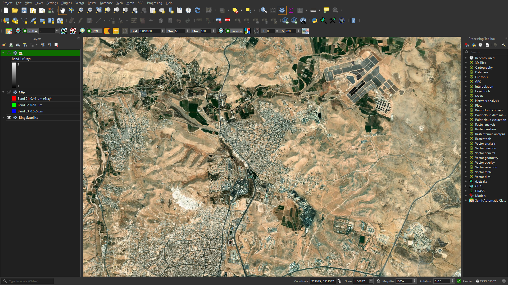
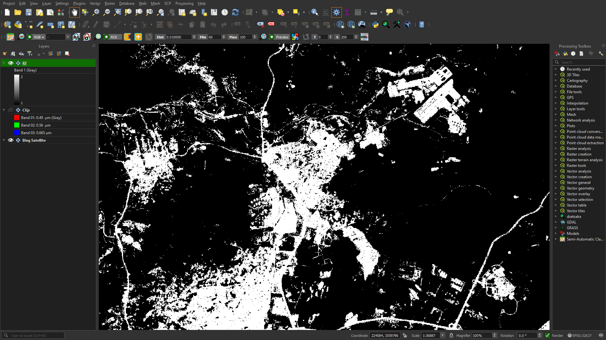

# ML with QGIS

Machine learning and Deep learning techniques appplied in classifying and tagging different elements of satellite image data.

## Appendix

     1. Image Classification using Random Forest classifier

## Screenshots
`1. Image Classification using Random Forest classifier`

i. Original image

ii. Classified the palces with construction vs the places without construction

